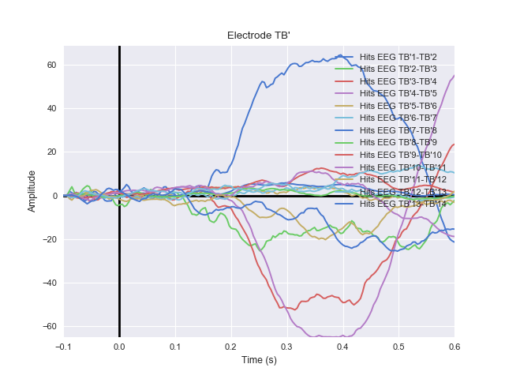
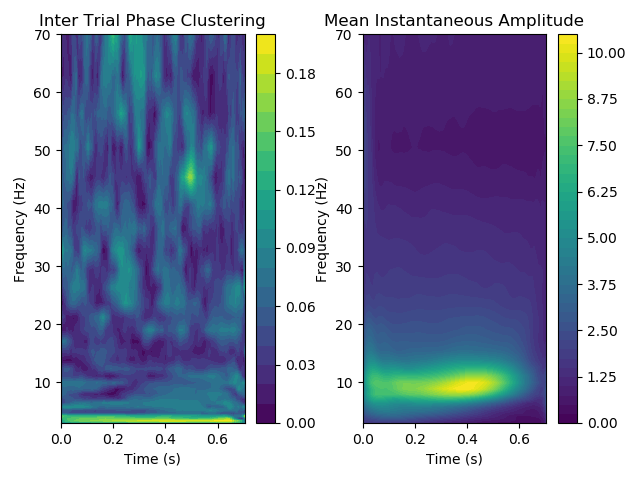
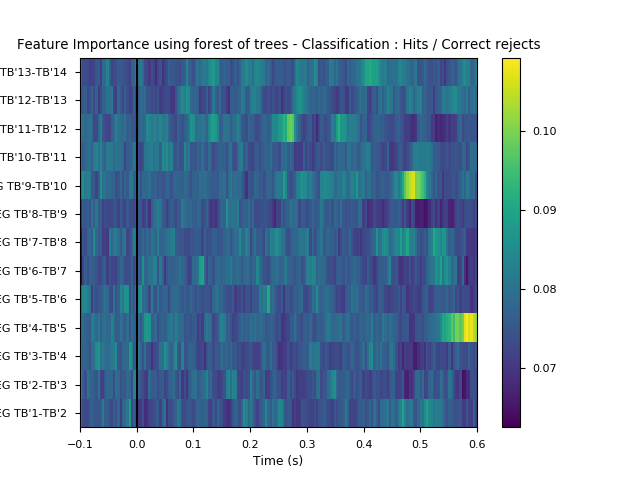
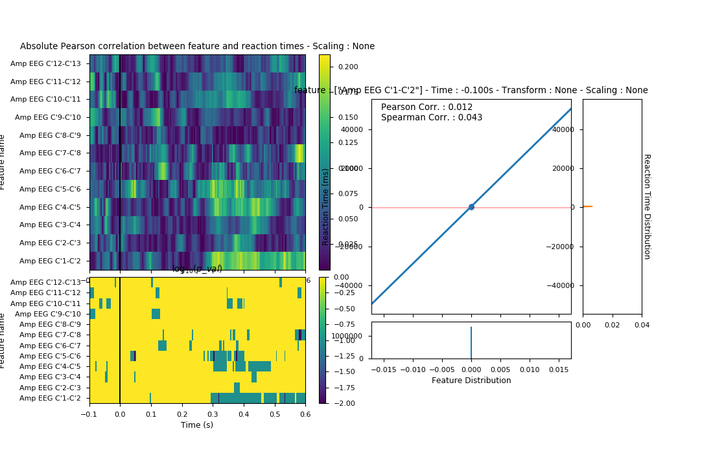

# SAB_main: Analyse the SAB experiment

Author: Martin Deudon

The SAB (Speed and Accuracy Boosting) was introduced in the following paper : https://www.researchgate.net/publication/263213203_The_speed_of_visual_recognition_memory

The SAB_main package allows you to do several analyses:
 * ERPs
 * Phase, ITPC (Inter-Trial Phase Coherence)
 * Feature extraction
 * Correlations between feature and reaction times

# Documentation 

The documentation is here : https://pysab.readthedocs.io/en/latest/

# Installation

SAB_main is using Python 3
The list of packages needed is in the requirements.txt file

# Screenshots

## ERP analyses

## Phase analyses

## Extract feature and evaluate their importance for predicting the behavioural response

## Evaluate correlation between features and reaction times

