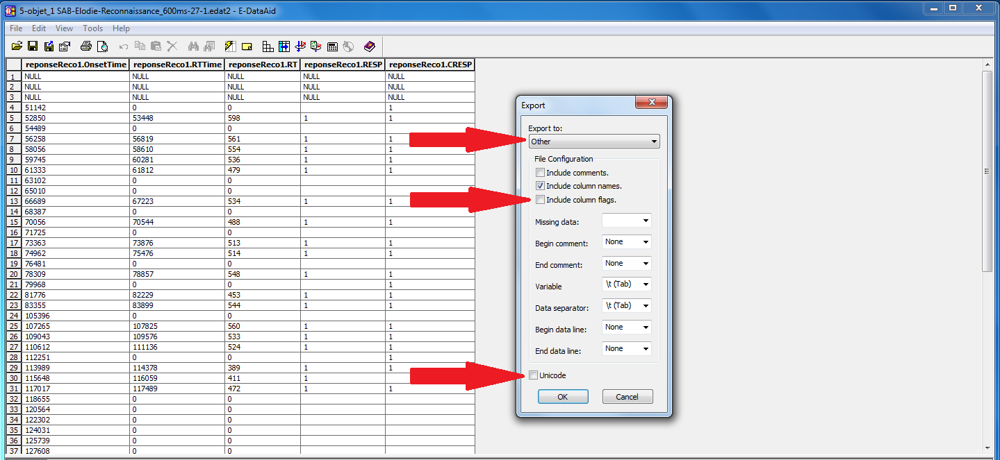
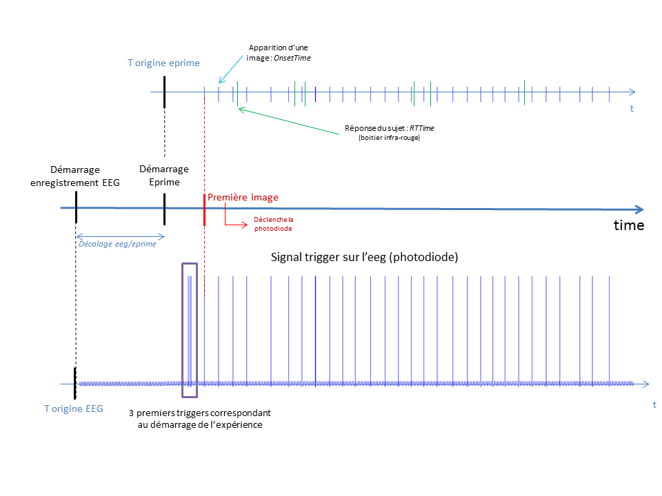
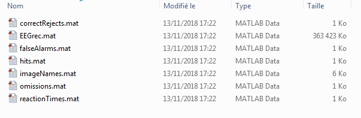
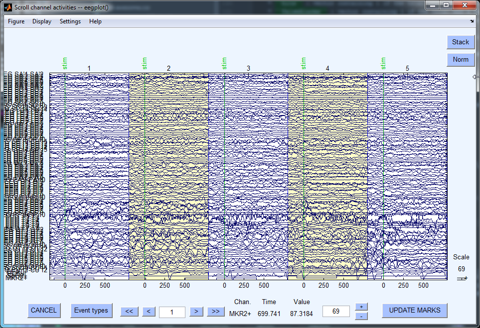

Matlab Dataset Creation, EEGrec, EEGenc
========================================

This document show how to create the SAB dataset. These datasets will allow you to run further analyses using the pySAB API.
They are created with Matlab scripts available `here <https://github.com/tinmarD/pySAB/tree/master/SAB_datasetCreation>`_

The procedure is described here :
 1. Convert the eprime file into text files.
 2. Organize your data files in .EDF format and your results text files obtained from the first step
 3. Use the MATLAB scripts to create the datasets

.. contents::
   :local:
   :depth: 3

Export eprime files to *.txt* files
------------------------------------------

**Naming Conventions**
~~~~~~~~~~~~~~~~~~~~~~~~~~~~~~~~~~~~

For REC files, name the file "SAB_REC_1_600ms.txt" where 1 is the file number, 600ms is the maximal reaction time.
For ENC files, replace "REC" by "ENC". It is important the that the file number is on 3rd position (with respect to
the '_' separators). The maximum reaction time is not mandatory.

**REC files**
~~~~~~~~~~~~~~~~~~~~~~~~~~~~~~~~~~~~

First select the following columns :
 * reponseReco1.OnsetTime : image onset time
 * reponseReco1.RTTime : subject response time : time at which it raises his finger from the response box
 * reponseReco1.RT : reaction time, i.e. = OnsetTime - RTTime
 * reponseReco1.RESP : subject response, 1 if he/she thinks the image was show before, 0 otherwise
 * eponseReco1.CRESP : correct response, 1 if the image was show before, 0 otherwise
 * image : image name

.. image:: ./../_static/images/conv_eprime.png
    :width: 1000px

Then **export** the selected columns to a text file. Go in File/Export/... Use the following parameters :

**ENC files**
~~~~~~~~~~~~~~~~~~~~~~~~~~~~~~~~~~~~

For the encoding phase files, you only need the following columns :
 * stimEnco1.OnsetTime : image onset time
 * image : image name

MATLAB scripts
--------------

You will need EEGLAB to run the scripts

Time offset between EEG files and Eprime files
~~~~~~~~~~~~~~~~~~~~~~~~~~~~~~~~~~~~~~~~~~~~~~~

The starting time of the Eprime software differs from the starting time of the iEEG recordings. Thus an offset exists
between the times in the Eprime files (and converted text files) and the time in the iEEG *.edf* files. To synchronize
both files we use the trigger corresponding to the onset of the first image, which must correponds to the time of the first
image in the Eprime file. This is done in the ``sab_getdatasets.m`` script.

This is illustrated bellow.

sab_getdatasets.m
~~~~~~~~~~~~~~~~~~

The main MATLAB script for creating dataset is ``sab_getdatasets.m``. This script can be used as a function or run like
a script.

**Note that a lot of parameters are defined in the first lines of this file, you will need to modify some of them**.
They are detailed here :
 * ``rec_only`` : If set to 1, only the dataset for REC files will be created.
 * ``save_mat`` : Should be set to 1, otherwise the datasets will not be saved.
 * ``EPOCH_TIME_BEFORE_STIM`` : Time taken before stimuli onsets to create the epochs
 * ``EPOCH_TIME_AFTER_STIM`` : Time taken after stimuli onsets to create the epochs
 * ``TRIGGER_THRESHOLD_MACRO`` : Triggers in Macro files will be detected if superior to this threshold
 * ``TRIGGER_THRESHOLD_MICRO`` : Triggers in micro files will be detected if superior to this threshold

The script will first ask the user to select the directory containing the EEG files in the *.edf* format and the
directory containing the results text files.

The script will then print what files have been detected and how the correpondency between EEG file and results file
has been done. **Check that the correpondency is correct!**

*Example :*

 .. code-block:: console

    8 ENC edf files found.
    8 REC edf files found.
    0 ENC eprime files found.
    8 REC eprime files found.
    REC files correspondence:
    SAB_REC_1_500ms.edf <------> SAB_REC_1_500ms.txt
    SAB_REC_2_500ms.edf <------> SAB_REC_2_500ms.txt
    SAB_REC_3_500ms.edf <------> SAB_REC_3_500ms.txt
    SAB_REC_4_500ms.edf <------> SAB_REC_4_500ms.txt
    SAB_REC_5_500ms.edf <------> SAB_REC_5_500ms.txt
    SAB_REC_6_500ms.edf <------> SAB_REC_6_500ms.txt
    SAB_REC_7_500ms.edf <------> SAB_REC_7_500ms.txt
    SAB_REC_8_500ms.edf <------> SAB_REC_8_500ms.txt

User is then asked if triggers are doubled. In some files, triggers always appears by 2 where there should be only 1.
The script try to detect it automatically weither it is the case or not.

The script try to detect bad channels and ask for confirmation. **Note that you can only decide to remove all the
bad detected channels or none**.

Generated files
~~~~~~~~~~~~~~~~~

**Output Path**

The script create the dataset along side the data directory containing the *.edf* files.

**Output Files**

The output directory should look like this :

Here only the REC dataset was created. The output files are :
    * ``EEGrec.mat`` : EEGLAB epoch dataset, for REC files.
    * ``correctRejects`` : vector containing 1 if the trial was a correct reject, 0 otherwise
    * ``hits`` : vector containing 1 if the trial was a hit, 0 otherwise
    * ``falseAlarms`` : vector containing 1 if the trial was a false alarm, 0 otherwise
    * ``omissions`` : vector containing 1 if the trial was an omission, 0 otherwise
    * ``imageNames`` : vector containing each image name
    * ``reactionTimes`` : vector containing the reaction time for each trial (for hits and false alarms, 0 otherwise)

These files will be needed for further analyses : **the SabDataset python class is created from these files.**

sab_rejectepochs.m
~~~~~~~~~~~~~~~~~~~

The file ``sab_rejectepochs.m`` can be used to check visually the epochs, using the EEGLAB interface. You can use it to
mark the bad epochs and reject them.

You will need to modify the first lines of the script :

 .. code-block::

    datasetInDirPath    = 'C:\Users\deudon\Desktop\SAB\_Data\003_JG\datasets_600ms';
    recOn               = 1;
    encOn               = 0;

The interface show all epochs in a row. To select an epoch, just click on it. When done, click on "UPDATE MARKS" and confirm
when asked to reject epochs. Bad epochs should now be rejected.

